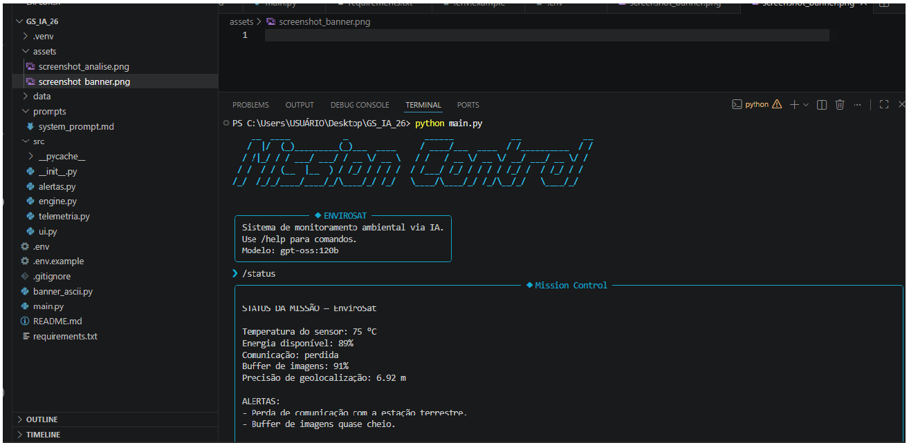

# Mission Control AI — EnviroSat

## Integrantes

- Sofia Lima - 567824
- Laura Olivera - 567277

---

## O que o projeto faz

O Mission Control AI é um sistema de monitoramento espacial baseado em IA generativa que simula a operação do satélite EnviroSat. O sistema coleta dados simulados de telemetria, detecta anomalias automaticamente e utiliza o modelo gpt-oss:120b via Ollama Cloud para gerar análises inteligentes em linguagem natural.

---

## Persona atendida

O sistema foi desenvolvido para operadores de centros de controle ambiental responsáveis pelo monitoramento de incêndios, desmatamento e áreas protegidas.

---

## Tecnologias utilizadas

- Python 3.10+
- Ollama Cloud API
- Modelo gpt-oss:120b
- rich
- pyfiglet
- prompt-toolkit
- python-dotenv

---

## Como executar

1. Clone o repositório

```bash
git clone https://github.com/sofiaoliveira0707-crypto/GS_IA.git
```

2. Crie o ambiente virtual

```bash
python -m venv .venv
```

3. Ative o ambiente virtual

Windows:

```bash
.venv\Scripts\activate
```

4. Instale as dependências

```bash
pip install -r requirements.txt
```

5. Crie um arquivo `.env` com:

```txt
OLLAMA_API_KEY=sua_chave
```

6. Execute o sistema

```bash
python main.py
```

---

## Demonstração




---

## Cenários testados

1. Operação normal
2. Temperatura crítica
3. Baixa energia
4. Perda de comunicação
5. Buffer de imagens elevado

---

## Limitações conhecidas

- O sistema utiliza dados simulados.
- Não há persistência de histórico da telemetria.
- O projeto não utiliza dados reais de satélites.

---

## Vídeo de demonstração

🎥 Link do YouTube aqui
